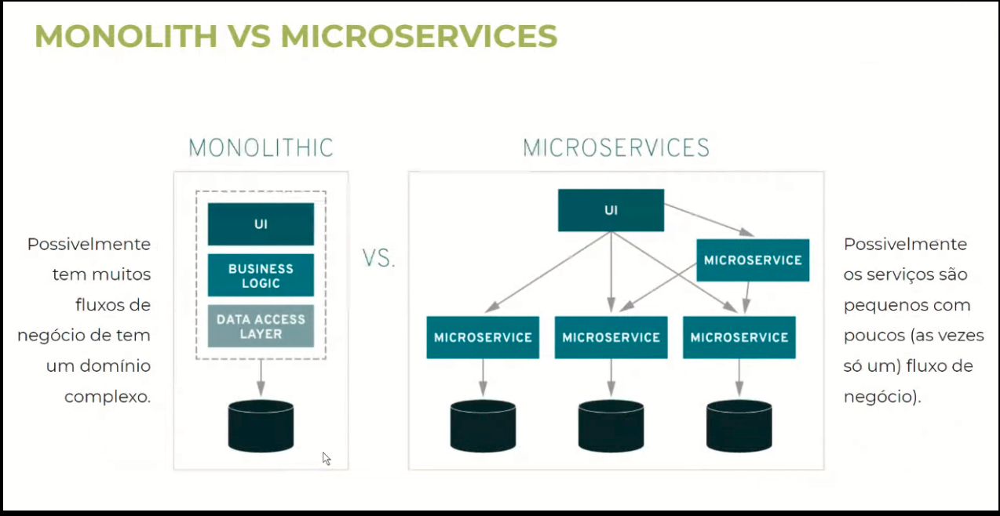
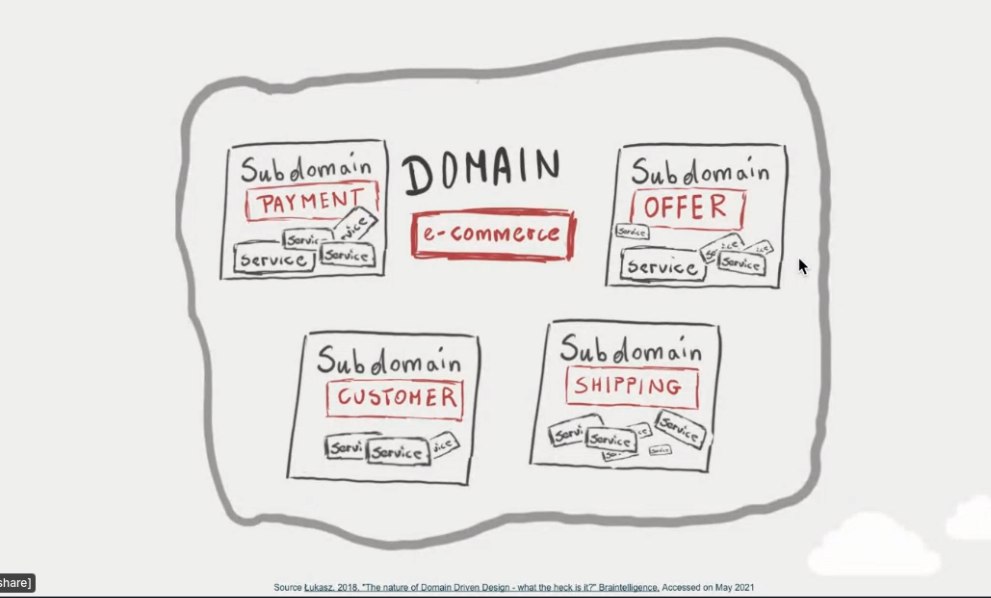
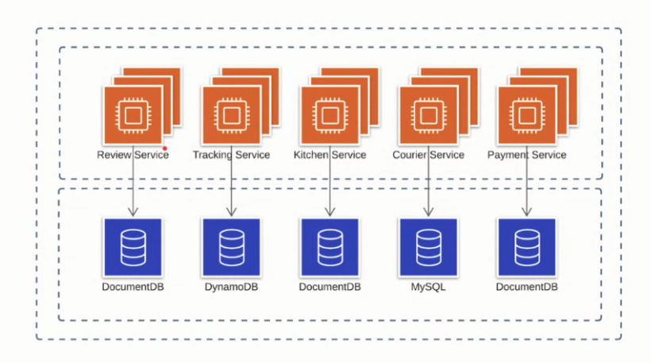
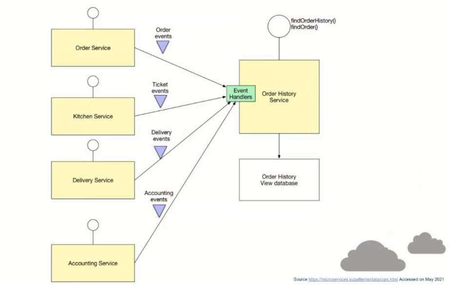
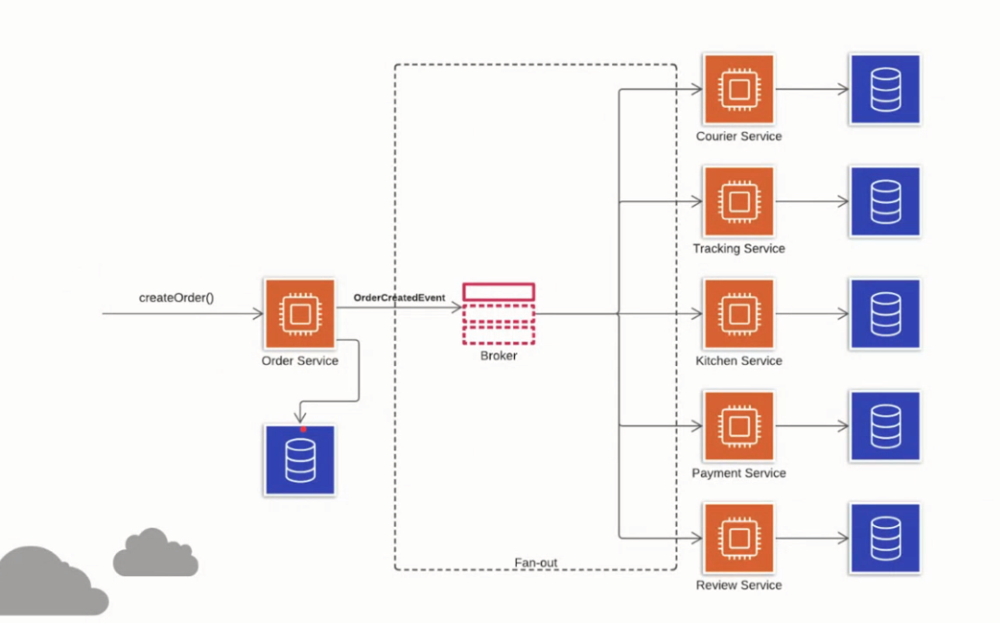
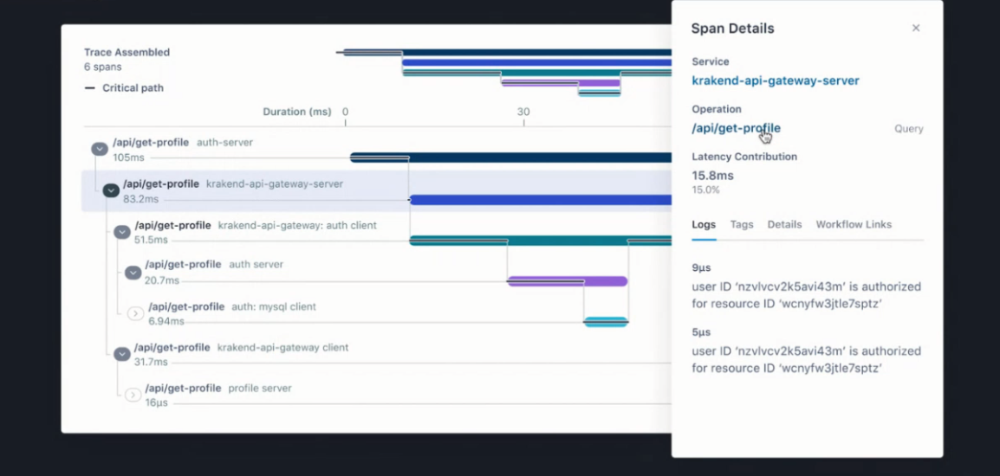
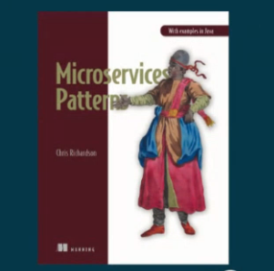
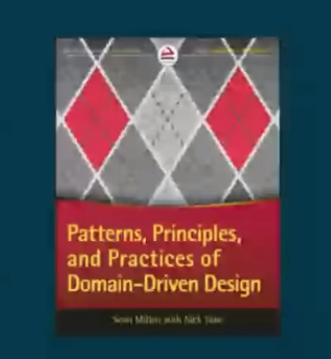
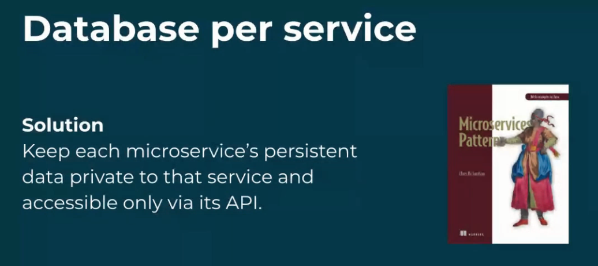

# O QUE É DESIGN PATTERNS

**Uma solução para um problema que existe (só aplicar quando o problema existe)**

Caso de Uso - 2 (duas) ruas se cruzando - soluções (semáforo, rotatória) = cada uma tem o seu custo e sua aplicação, depente muito do cenário


# MICROSSERVIÇOS

## O que é?

Abordagem para a arquitetura de software com o foco na construção de pequenos serviços com uma única responsabilidade, que funcionem de forma independente.


## Objetivo

Facilitar a implantação e a escalabilidade, aumentar a tolerância à falhas, aumentar a coesão e reduzir o acoplamento.


## Por que usar?

Redução de custos. Escalar parte do todo é mais barato que escalar o todo. Implantar mais rápido tem resultados mais rápido. Códigos menores e objetivos são mais fáceis de manipular.


## Quando não utilizar?

- Quando os serviços são dependentes. Se os microsserviços possuem alta dependência, possivelmente você está fazendo um monolito distribuído.

- O ambiente não é cloud ou muito limitado. A capacidade elástica de provisionamento e a forma de precificação da nuvem é um dos responsáveis pelos maiores benefícios da redução de custos.

- Não tem cultura DevOps/automatização de processos. Se não existe colaboração entre as equipes Dev e Ops e os processos ainda não são automatizados.

- Você está começando um projeto (MVP)

- Você ainda não precisa. Sua aplicação ainda não tem muito volume, possui um time restrito, tudo funciona muito bem do jeito que tá e o esforço no momento será muito grande.

- Quando o time é "muito júnior" ou não tem conhecimento sobre


## Dicas

- Microsserviços NÃO é quebrar sua aplicação em várias que se chamam loucamente e dependentemente entre si!

- Um microsserviço deve ter apenas uma responsabilidade!

- Respeite a base de dados do outro serviço. Acesso e operações somente via esse "outro serviço"!

- Segmente sempre que possível. Acoplamento não é bom.

- Comunicação entre microsserviços é prioritariamente assíncrona!

- Nâo dependa de dados de terceiros




<br>

# DECOMPOSIÇÃO 
**Como pegar uma aplicação grande e quebrar em microsserviços?**

   
## Padrão de projeto DDD (Domain Driven Design) - Subdominios


## O que é?

Abordagem para o desenvolvimento de software em que seu design é orientado pelo domínio/subdominio.


## Objetivo

Manter sob controle a complexidade inerente aos softwares que atendem necessidades complexas.


## Por que usar?

Redução de custos. Complexidade gera custo de desenvolvimento, evolução, manutenção, reduz a qualidade, degrada a performance. Todos esses custos também são custos em $$$. 

Ex: Domínio (E-commerce) - Subdominios (payment, offer, customer, shipping)


## Quando não utilizar?

- Quando o problema a ser resolvido não é complexo. Tentar usar DDD para problemas simles só trás complexidade

- Aplicações com um "domínio" bem definido. Proxies, BFFs, CRUDs, aplicações comuns que não variam nos seus casos de uso

- Aplicações muito pequenas e/ou estáticas. Se sua aplicação tem poucos fluxos de negócio ou não existe uma visão de evolução clara, possivelmente vc não precisa


## Complexidades do DDD

DDD envolve conhecimento profundo dos fundamentos. Dificilmente sem conhecimento e experiência com orientação à objetos, SOLID, design patterns e outros fundamentos será possível atuar com DDD.

Muitas "camadas" desnecessárias. DDD não é sobre separar o projeto em muitas pastas/projetos, isso não reduz necessariamente o acoplamento.


## Dicas

- Linguagem Ubíqua. Fale tudo como todos que entendem do negócio falam.

- Context Map. Entenda as aplicações, os times e como tudo se conecta.

- Bounded Context. Defina e entenda bem o contexto das aplicações que serão desenvolvidas.

- Interfaces, entidades e regras de negócio. Desenvolva sempre orientado à interfaces, centralize as regras de negócio nas entidades, use e abuse do SOLID e de Clean Code.




<br>

# GESTÃO DE DADOS

## Como desenhar o banco de dados em microsserviços?

Cada microsserviço tem que ter seu própio banco de dados - Ex: isolar as bases por schemas, bancos diferentes, etc ...



## Problema 1 - Não ter acesso a todos os dados, a transação só tem acesso ao dados do banco do microsserviço ##

Solução: Padrão de projeto CQRS(Command Query Responsability Segregation) - É separar a responsabilidade de escrita e leitura de seus dados. Um microsserviço é responsável pela inserção de dados e outro responsável por ler os dados (Ajuda a escalar independentemente conforme a necessidade).
  
  - Problema: Duplicação de código  -  Os 2 microsserviços vão lhe dar com mesmo sub-dominio.
  - Problema: Consistência eventual -  O inserir o dado pelo microsserviço de inserção o de leitura não terá o dado instantâneamente, existe um delay 
      - Solução: Utilizar mecânismos de compensação e/ou retry
  - Problema: Como unir informações 
      - Solução: Utilizar <b>VIEWS MATERIALIZADAS</b> apesar de ainda ter o problema da consistência eventual



## Problema 2 - Como atualizar as bases de dados em microsserviços diferentes? ##

Solução: Padrão de projeto Event sourcing / Fan-out - É a capacidade de uma informação ser multiplicada para outros consumidores. Onde um evento de criação de um pedido por exemplo seja multiplicado e entregue à diferentes microsserviços. Ex de tecnologia: Mensagerias (SNS, Rabbit MQ), Streams(Kafka, Kinessis) ou até fila em banco

   - Problema: Consistência eventual -  Enquanto a mensagem passa pelo message brocker, por mais que seja rápido haverá um delay




<br>

## OBSERVABILITY
Como monitorar todas as instâncias e serviços distribuidos (Logs distribuidos)?
	
## Padrão de projeto Distributed tracing 
Atribui a cada solicitação externa um id único e inclui esse id em todas as mensagens de log. Com um único tracing id vc rastreia tudo o que aconteceu dentro da sua infraestrutura, extraindo todos os logs. Utilizando de ferramentas vc saberá quais microsserviços foram disparados em sequência e quanto tempo cada um demorou a executar.

```
Custo elevado $$$
```





<br>

## BIBLIOGRAFIA

 
<br>

<br>

